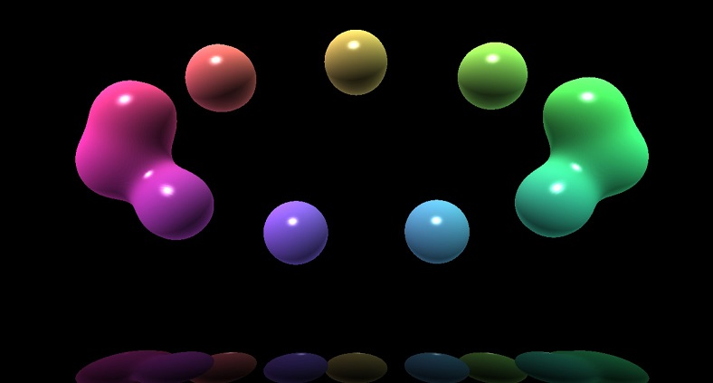

# OpenGL/GLSL Volume Rendering



Ray-casting volume rendering experiments in OpenGL/GLSL for Windows.


# Dependencies

Project uses *conan* to install:
* GLM: https://github.com/g-truc/glm
* GLAD: https://github.com/Dav1dde/glad
* GoogleTest: https://github.com/google/googletest


# Build

To test and build, run *conan* and *cmake*:

```
mkdir build
conan install . -if build -s build_type=Release -s compiler.runtime=MD
cd build
cmake .. -DCMAKE_BUILD_TYPE=Release
cmake --build . --config Release --target volume_lib
cmake --build . --config Release --target unit_tests
ctest -C Release  -VV
cmake --build . --config Release --target INSTALL
```

The executable with shaders can be found in ```build/product```.

# Usage

Hotkeys:

* ```Esc```: close application
* ```Space Bar```: pause/start animation
* ```Backspace``` or ```D```: remove object
* ```A```: add object
* ```N```: toggle procedural noise deformation on/off
* ```0``` to ```9```: different rendering/shading modes

The rendering modes are:

* 1: object normals
* 2: Lambertian reflectance
* 3: Phong reflection
* 4: Fresnel effect
* 5: Hard shadows
* 6: Volumetric light effect
* 7: object colors
* 8: reserved
* 9: "blood" effect combining the above effects
* 0: default rendering combining the above effects
